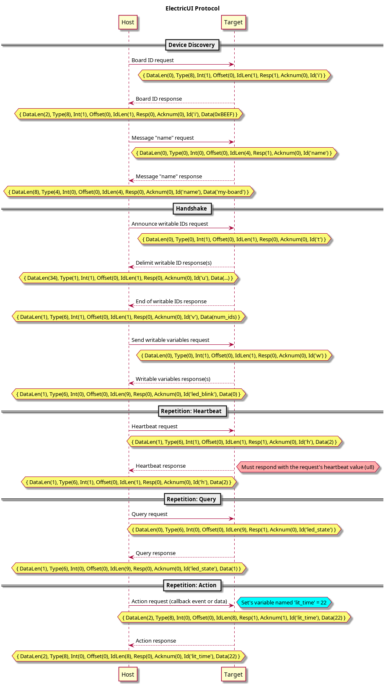

# electricui-embedded &emsp; ![ci] [![crates.io]](https://crates.io/crates/electricui-embedded) [![docs.rs]](https://docs.rs/electricui-embedded)

An unofficial and incomplete `no_std` Rust library for
implementing the [ElectricUI Binary Protocol](https://electricui.com/docs/hardware/protocol).

This is mostly for me to hack on things using their wire protocol currently.

https://github.com/electricui/electricui-embedded

https://electricui.com/docs/

https://electricui.com/docs/hardware/protocol

## Example

See [electricui-embedded-stm32f4-example](https://github.com/jonlamb-gh/electricui-embedded-stm32f4-example).

## Protocol

## License

Licensed under either of

 * Apache License, Version 2.0, ([LICENSE-APACHE](LICENSE-APACHE) or http://www.apache.org/licenses/LICENSE-2.0)
 * MIT license ([LICENSE-MIT](LICENSE-MIT) or http://opensource.org/licenses/MIT)

at your option.

[ci]: https://github.com/jonlamb-gh/electricui-embedded-rs/workflows/CI/badge.svg
[crates.io]: https://img.shields.io/crates/v/electricui-embedded.svg
[docs.rs]: https://docs.rs/electricui-embedded/badge.svg
